# 巨灾风险建模与风险管理

关键词: Seismic Loss、Life-Long Insurance、Retrofitting

苏锦华 2021.10.27

Available at https://github.com/SmartDataLab/DR-Share

Written by Marp and Mermaid in Markdown

---

# Background

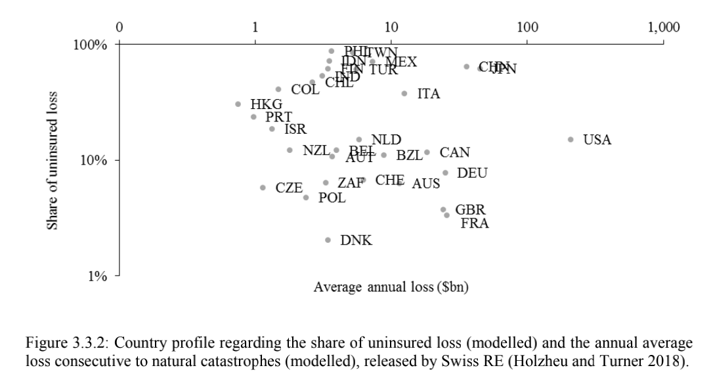

---

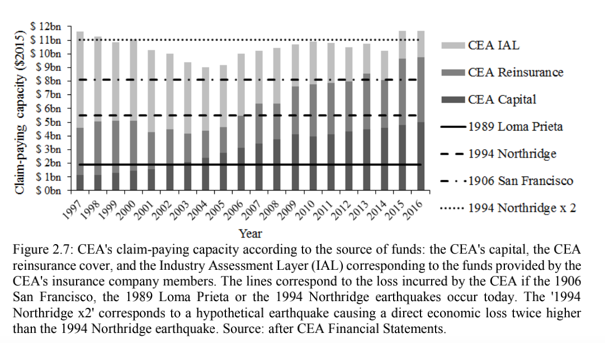

---

# <!--fit-->Previous Methods and Problem

- mutualisation(current）
- parametric(new) -- Stakeholders
- allocation
- sociétés mutuelles d’assurances -- CAT-NAT

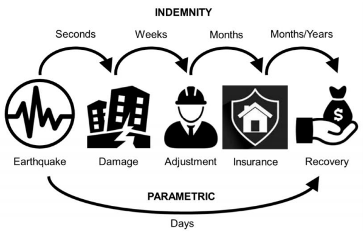

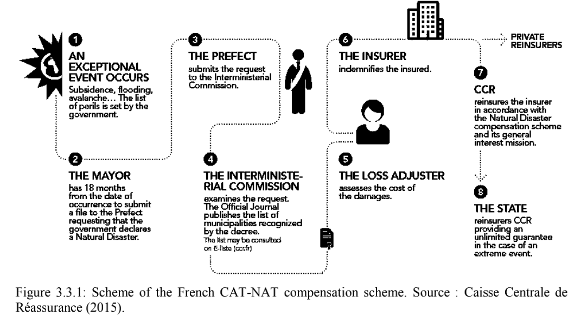

---

# Previous Research Target

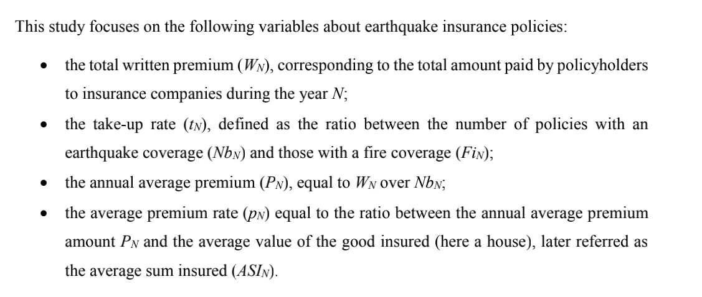

---

# Target cont.

- Utility of homeowners
$$
g_{N}\left(t_{N}\right)=K-t_{N} \times P_{N}-K \times\left(1-t_{N}\right) \times \mathrm{B}_{\mathrm{EQ}}\left(r_{N}\right)
$$

$$
t_{N}^{\text {Estimated }}=\underset{0 \leq t_{N} \leq 1}{\operatorname{argmax}} \mathbb{E}\left(U\left(g_{N}\left(t_{N}\right)\right)\right)
$$

- CAT-NAT logit

$$
\ln \left(\frac{\mathbb{P}(C N \mid(P o p, M S K))}{1-\mathbb{P}(C N \mid(\text { Pop }, M S K))}\right)=0.75 \times \log _{10}(\text { Pop })+2 \times M S K-13.14
$$

---

# Challenge

- Homeowners' risk perception(individual -- country)
- Observation Data -- ShakeMap footprints
- Exposure: Asset Value Map & Damage Map

---

# homeowners' risk perception

 At the scale of a California homeowner, the average annual 

probability to be affected by such an earthquake is only at 0.038%
The homeowners' risk perception is controlled by both the risk materiality (what kind of earthquakes are expected to occur?) and the risk tolerance (how much homeowners are ready to lose?).

---

# homeowners' risk perception cont.

The lines AWRN = 70%, AWRN = 100% and AWRN =425% stand for the current situation, the 
true risk level and the target value of AWRN for tN
Estimated=100%, at the current price at $980 
(USD 2015), respectively. According to the first one (AWRN = 70%), half of homeowners 
(tN
Estimated = 50%) are not willing to pay an average premium amount exceeding PN=$310 (USD 
2015) per year, for an insurance cover. This would represent a 68% decrease in the price of 
earthquake insurance coverage.
On the opposite, the relatively low earthquake risk awareness (AWRN =70%), contributes only 
marginally to the current low take-up rate (tN
Estimated = 14%). In fact, even with the true level of 
risk (AWRN =100%), only tN
Estimated = 21% of homeowners are expected to subscribe an 
insurance. This result is consistent with previous findings by Shenhar et al. (2015) who 
observed in Israel that the earthquake insurance take-up rate did not significantly increase after 
a large prevention campaign.

---

# ShakeMap

 For that, the ShakeMap footprints, released by the U.S. Geological Survey (USGS), are used. A ShakeMap footprint gives, for a historical earthquake, the modelled ground motions for several metrics, including the macroseismic intensity on the Modified Mercalli Intensity scale (MMI)

 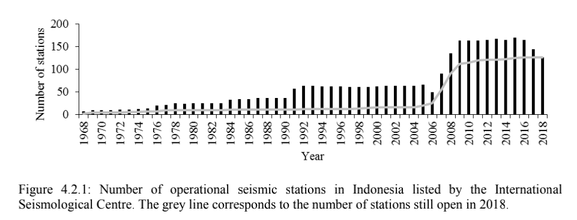

---

# ShakeMap Evluation

$$
\mathbb{P}\left(\mathrm{S}_{N} \geq k\right)=\mathbb{P}\left(\sum_{i \in N}\left[\mathrm{PGA}_{i}^{50} \geq \operatorname{PSHA}_{i}\right] \geq k\right)=\left(\begin{array}{c}
\# N \\
k
\end{array}\right) b^{k}(1-b)^{\# N-k}
$$

 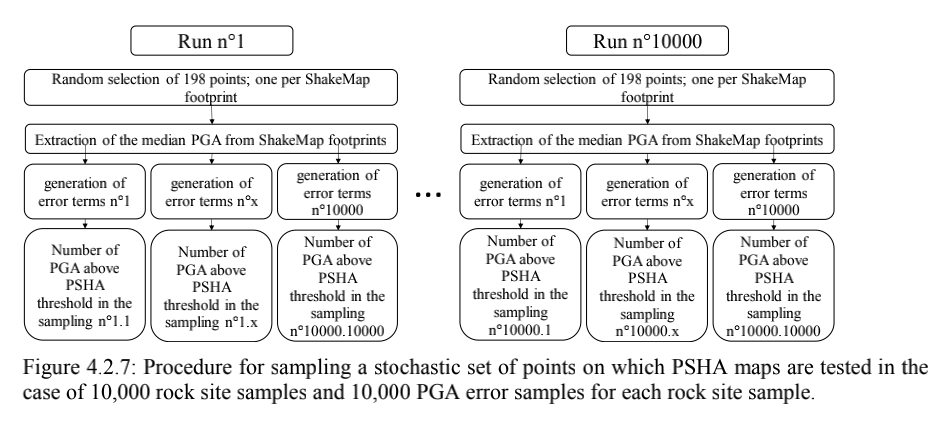

---

# <!--fit-->ShakeMap Result

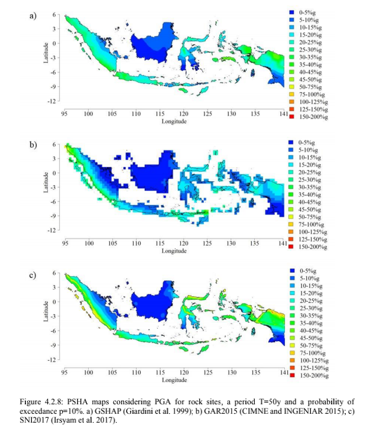

PSHA maps: Probabilistic Seismic Hazard Assessment

---

# Asset Value Map

- GDP based

$$
\text { Normalized Damage }_{t}^{s}=\text { Damage }_{t} \times \frac{\text { GDP Deflator }_{\text {s }}}{\text { GDP Deflator }_{t}} \times \frac{\text { Pop }_{\text {s }}}{\text { Pop }_{t}} \times \frac{\text { Wealth per capita }_{s}}{\text { Wealth per capita }_{t}}
$$

$$
\text { GDP Deflator }_{t}=\frac{\text { Nominal } G D P_{t}}{\text { Real } G D P_{t}}
$$

- Remote Sensing Based
	- Night Light
	- Phone Signal

---

# <!--fit-->Material Damage Map

$$
H D^{B}=2.5 \times\left(1+\tanh \left(\frac{1+6.25 \times V-13.1}{2.3}\right)\right)
$$

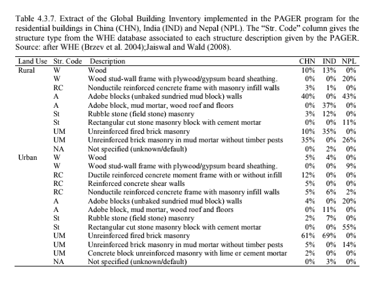

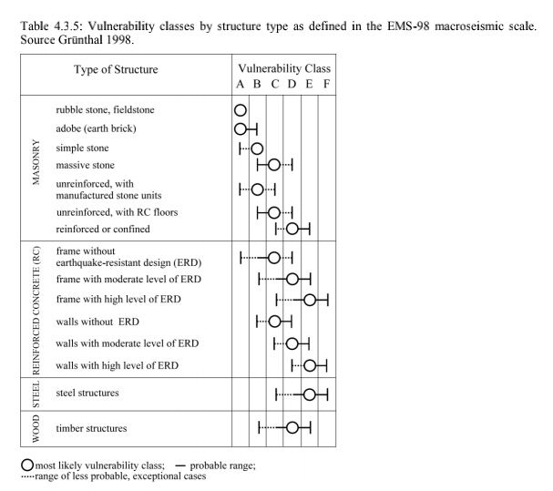

---

# Model Preview

For several seismic-prone countries, current earthquake insurance solutions cover only a small part of the economic loss. Innovative insurance products like parametric insurance are emerging for which the compensation is calculated upon a trigger instead of a claim amount, covering more people but with drawbacks due to probable difference between the insurance compensation and the actual loss.

---

# Property & Advantage

- **Practicability**: `the compensation is to rebuild the insured house, instead of paying a financial amount;`
- **Allocation**: `the model leverages both on long-term financial investment and seismic retrofitting of the insured buildings to make the premium amount affordable;`
- **Retrofitting**: `joint participation of the public authorities and the homebuilder companies in this insurance model are expected since the first ones are the key player in risk prevention plans and the second ones are the beneficiary of this new market .`

---

# Notation

`The first section introduces some key insurance notions, later used in this study to describe this proposed earthquake insurance model.`

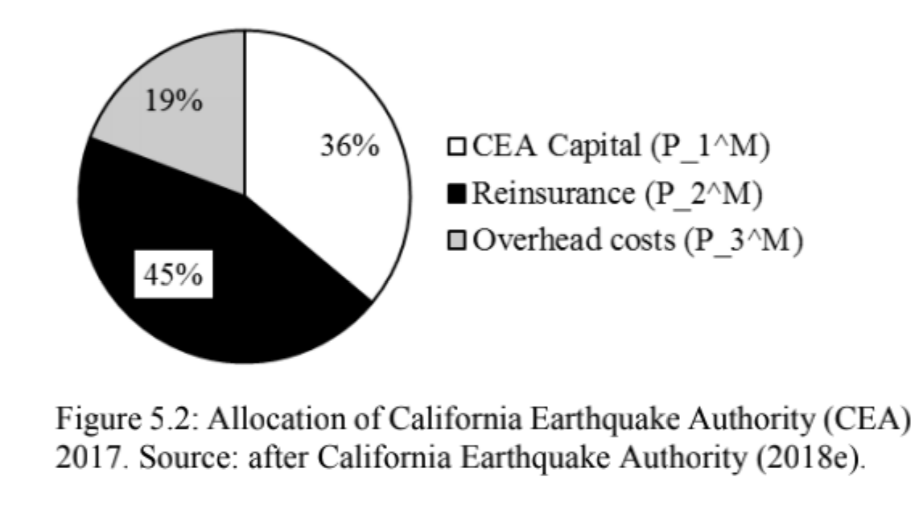

$$
P_{1}^{M}+P_{2}^{M}=\frac{\mathbb{E}\left(L_{E Q}\right)-F}{\mathbb{E}\left(Y_{E Q}\right)}
$$

---

The premium shares corresponding to the reinsurance (𝑃2𝑀) and the CEA overhead costs (𝑃3𝑀) are spent each year and therefore, cannot be invested on financial markets. Therefore, only the share of the premium not used to pay claims and retained as capital (Fig. 5.2: 𝑃1𝑀 = 36%𝑃𝑀) is available for investing on financial markets. However, since the funds are dedicated to pay future insurance claims, they must be very immediately available and only invested in very secure and liquid financial products. For a given currency, one of the most secure financial products to invest in is the long-term treasury bonds of high-rated countries.

---

# <!-- fit --> A life insurance mechanism to increase affordability

`Next, the choice to build it according to life insurance 
principles instead of property insurance scheme is motivated.`

- Calculate the annual premium amount P under the allocation.
$$
P_{1}^{E Q}=P_{1} \times\left(1+t_{I}\right)^{Y_{E Q}-1}+P_{1} \times\left(1+t_{1}\right)^{Y_{E Q}-2}+\cdots+P_{1} \times\left(1+t_{1}\right)+P_{1}
$$

$$
\mathbb{E}\left(P_{1}^{E Q}\right)=P_{1}^{M} \times \mathbb{E}\left(Y_{E Q}\right)=\left(\mathbb{E}\left(L_{E Q}\right)-F\right) \times \frac{36 \%}{81 \%}
$$

 $$
\sum_{i=1}^{+\infty}\left[P_{2} \times \mathbb{P}\left(Y_{E Q} \geq i\right)\right]=\frac{45 \%}{81 \%} \times\left(\mathbb{E}\left(L_{E Q}\right)-F\right)
$$

---

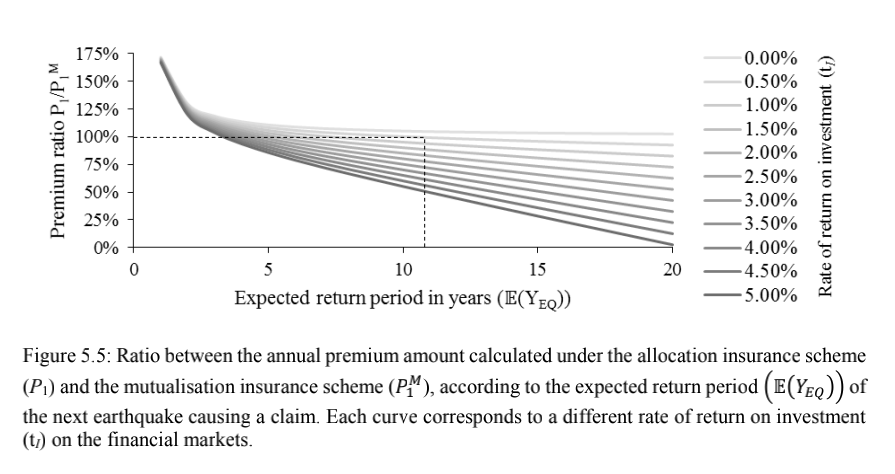

---

# Case study

`In the third part, a probabilistic loss model combining the UCERF3 (Field et al. 2013) and the HAZUS-MH MR5 (Federal Emergency Management Agency 2010) models for California is introduced to then produce premium amount estimates.`

---

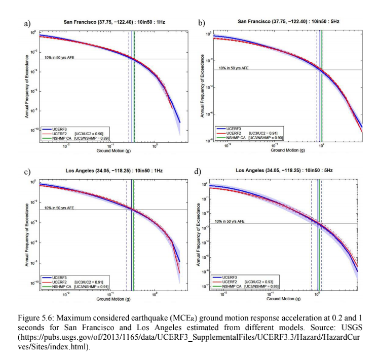

---

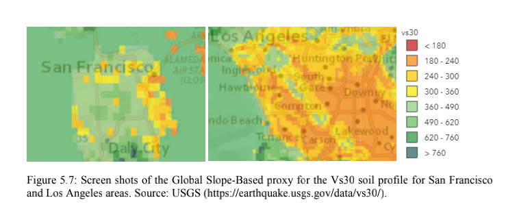

---

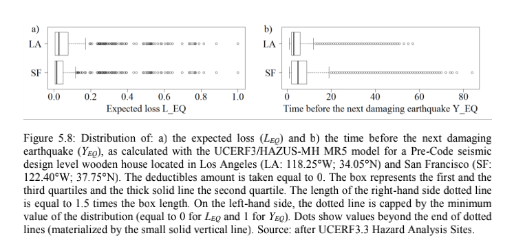

---

# <!-- fit -->Leveraging on building retrofitting works

`The fourth section is about the benefit of earthquake retrofitting works for the insurance scheme.`

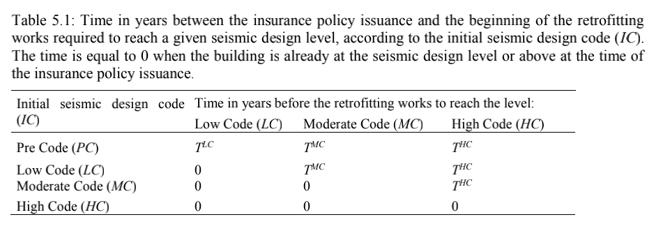

---

$$
\begin{aligned}
\sum_{i=1}^{+\infty}\left[P_{1} \times\left(1+t_{l}\right)^{i-1} \times \mathbb{P}\left(Y_{E Q} \geq i\right)\right] \\
&=\sum_{i=1}^{T^{L C}}\left[P_{1} \times\left(1+t_{I}\right)^{i-1} \times \mathbb{P}\left(Y_{E Q} \geq i \mid Y_{E Q} \leq T^{L C}\right)\right] \times \mathbb{P}\left(Y_{E Q} \leq T^{L C}\right) \\
&+\sum_{i=1}^{T^{M C}}\left[P_{1} \times\left(1+t_{I}\right)^{i-1} \times \mathbb{P}\left(Y_{E Q} \geq i \mid T^{L C}<Y_{E Q} \leq T^{M C}\right)\right] \times \mathbb{P}\left(T^{L C}<Y_{E Q} \leq T^{M C}\right) \\
&+\sum_{i=1}^{T^{H C}}\left[P_{1} \times\left(1+t_{1}\right)^{i-1} \times \mathbb{P}\left(Y_{E Q} \geq i \mid T^{M C}<Y_{E Q} \leq T^{H C}\right)\right] \times \mathbb{P}\left(T^{M C}<Y_{E Q} \leq T^{H C}\right) \\
&+\sum_{i=1}^{+\infty}\left[P_{1} \times\left(1+t_{1}\right)^{i-1} \times \mathbb{P}\left(Y_{E Q} \geq i \mid T^{H C}<Y_{E Q}\right)\right] \times \mathbb{P}\left(T^{H C}<Y_{E Q}\right)
\end{aligned}
$$

$$
\begin{aligned}
\mathbb{E}\left(L_{E Q}\right)=\mathbb{E}\left(L_{E Q} \mid Y_{E Q} \leq T^{L C}\right) \times \mathbb{P}\left(Y_{E Q} \leq T^{L C}\right) \\
&+\mathbb{E}\left(L_{E Q} \mid T^{L C}<Y_{E Q} \leq T^{M C}\right) \times \mathbb{P}\left(T^{L C}<Y_{E Q} \leq T^{M C}\right) \\
&+\mathbb{E}\left(L_{E Q} \mid T^{M C}<Y_{E Q} \leq T^{H C}\right) \times \mathbb{P}\left(T^{M C}<Y_{E Q} \leq T^{H C}\right) \\
&+\mathbb{E}\left(L_{E Q} \mid T^{H C}<Y_{E Q}\right) \times \mathbb{P}\left(T^{H C}<Y_{E Q}\right)
\end{aligned}
$$

---

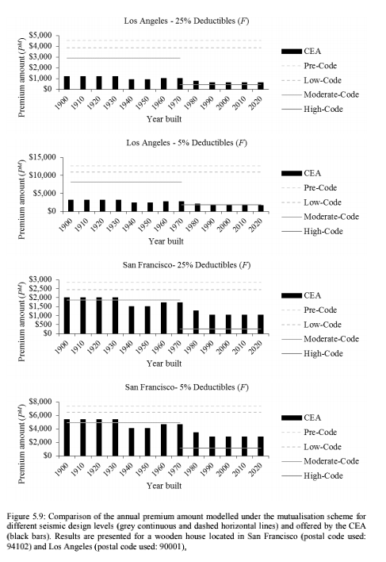

---

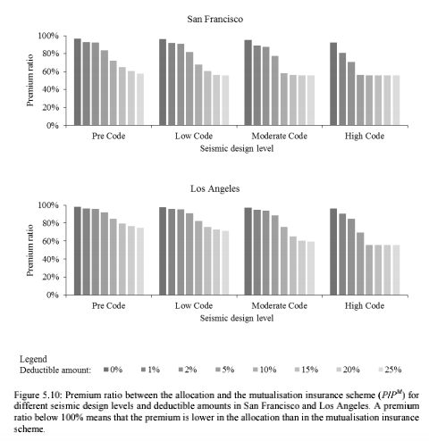

---

# <!-- fit -->Involving homebuilder companies and public authorities

`Finally, the contribution of homebuilder companies and public authorities to this insurance scheme is investigated.`

$$
\text { expected earnings }= \begin{cases}b \times W_{L C} & \text { for retrofitting works from } P C \text { to } L C \\ b \times W_{M C} & \text { for retrofitting works from } L C \text { to } M C \\ b \times W_{H C} \\ b \times \mathbb{E}\left(L_{E Q}\right) & \text { for retrofitting works from } M C \text { to } H C \\ \text { for repairs/reconstruction works }\end{cases}
$$

$$
m= \begin{cases}\mathbb{E}\left(\min \left(T^{L C} ; Y_{E Q}\right)\right) & \text { if } I C=P C \\ \mathbb{E}\left(\min \left(T^{M C} ; Y_{E Q}\right)\right) & \text { if } I C=L C \\ \mathbb{E}\left(\min \left(T^{H C} ; Y_{E Q}\right)\right) & \text { if } I C=M C \\ E\left(Y_{E Q}\right) & \text { if } I C=H C\end{cases}
$$

---

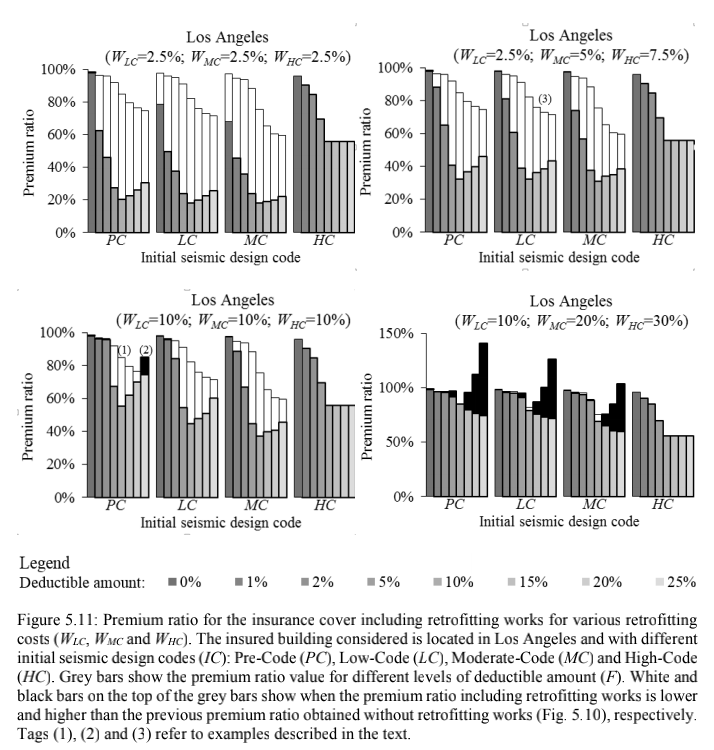

---

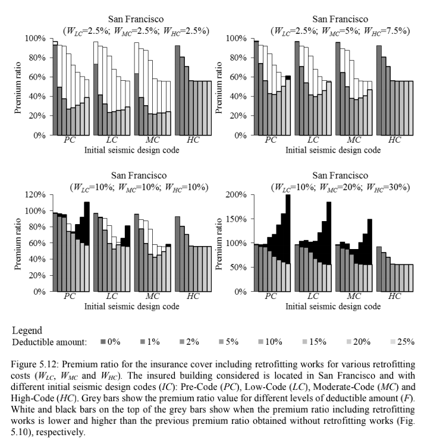

---

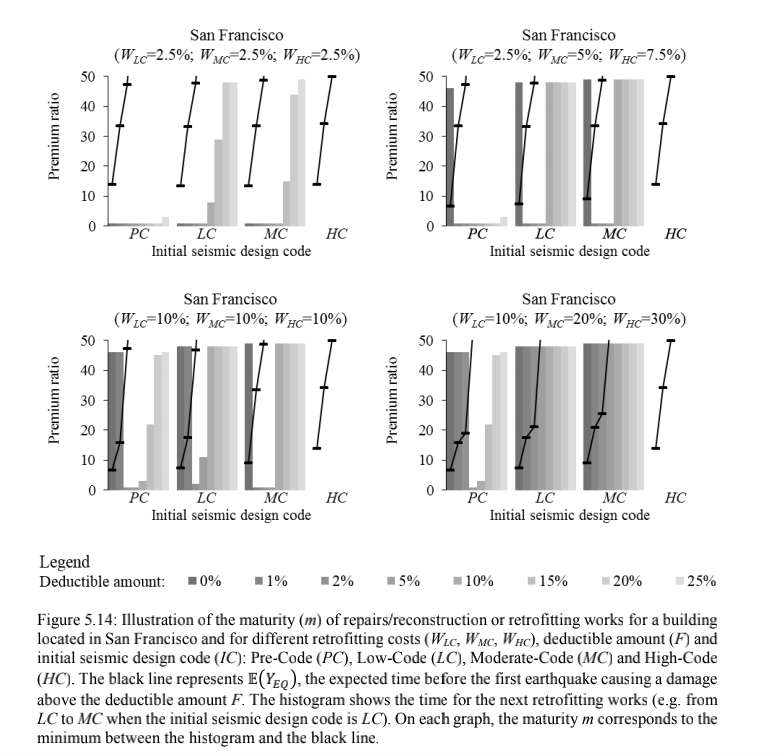

---

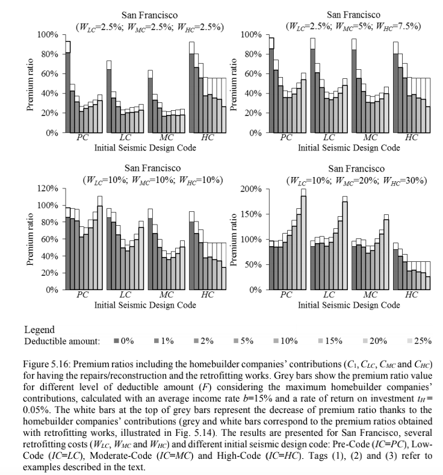

---

# Conclusion

`The model is tested with several case studies in California, where only 15\% of homeowners are currently covered against the earthquake risk. Results show that in most cases the price (i.e. premium amount and retrofitting costs) for this earthquake insurance model is lower than the premium amount considering the traditional earthquake insurance. For the optimal deductible amount, the decrease can even be three times lower than for classical model, by assuming a contribution from both the public authorities and the homebuilder companies. Such a decrease could raise the rate of California homeowners insured against earthquake risk from 15% up to 50%`

